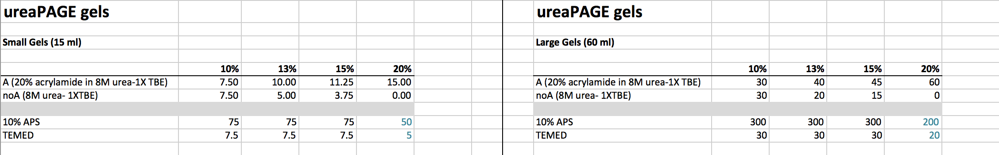
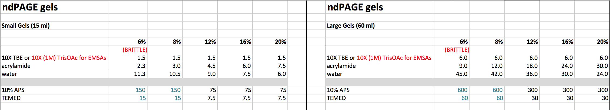

**Background**: These recipes describe the prep, run and analysis of gels for resolving small ss- or ds- nucleic acids. ureaPAGE is denaturing, for ssDNA/RNA (or dsDNA/RNA when you are interested in the separate strands). ureaPAGE is the default way to analyse small nucleic acids. It's a very reliable method, just be careful of the urea. ndPAGE is non-denaturing, for ssDNA/RNA when you're interested in the structures that are formed or whether your samples are uniformly folded/not, or for analysing dsDNA/RNA as duplexes. ndPAGE is also the method to use for EMSAs, when you want to analyse complexes formed by nucleic acid: protein substrates. Note that during ndPAGE your NAs will not move through the gel by size, but by size and 'shape'. I have mostly used these for DNA work; RNA work may need further precautions to stop degradation.

---

### Gels for ureaPAGE (denaturing)
2012, 2015-present

---

##### Components required:

* Gel system : Biorad or otherwise
* Gel components (and their locations)
  * dH2O
  * **(A): 8M urea-1X TBE-20% acrylamide premix**(1)
  * **(noA): 8M urea-1X TBE premix**(2)
  * . __acrylamide is a neurotoxin. see Safety Note, below__
  * 10% APS (aliquots at -20oC), TEMED (brown bottle, 4oC)
* 1X TBE Running buffer
* DNA ladder if applicable
* Your samples, in **ureaPAGE loading buffer**(3), **denatured**

---

##### Prep:

(1 and 2) **urea-TBE-(-+acrylamide) premixes**

(1) **[A]: the one with acrylamide.** (*8M urea-1X TBE-20% acrylamide*) the fun bit!! ... as urea is difficult to dissolve and for various reasons it needs to be dissolved into acrylamide rather than water (see note later), one needs to prepare a urea/buffer mixture beforehand. **leave 2h for this.** _happily, once made, a 1L stock should last a few weeks-months depending on usage frequency and size of gels. (if 3 postdocs are using it on moderate usage, it's weeks. if 4 postdocs are running lots of large (60ml) gels, it's less!)_

* components: urea (solid), 40% **19:1** acrylamide/bis, 10X TBE
* for 1L mix:
    * take 2L beaker, place on magnetic stirrer w magnet
    * carefully add 500 ml __19:1__ acrylamide/bis
    * put stirrer on, at gentle speed
    * measure urea (x g = 8 M final (what is required, from memory)) into beaker. will take a few goes. add to acrylamide bit by bit
    * cover mixture with cling film and __label: ureaPAGE mix [contains acrylamide]__
    * note: __this will take ages to go into solution. when it has, its volume will have increased dramatically. typically there will be just about enough "space" to add the TBE__ transfer to measuring cylinder to check volume. add 100ml 10X TBE, top up with dH2O.

(2) **[noA]: just urea and TBE.** (*8M urea-1X TBE*) as above, but dissolve urea in water first, then add TBE.

(3) **ureaPAGE Loading Buffer** (*formamide-EDTA-orangeG*)
* 95% deionised formamide (buy it in)
* ~10 mM EDTA
* touch of orangeG (runs at very bottom, fluoresces in FITC channel from memory)
* see http://cshprotocols.cshlp.org/content/2006/6/pdb.rec10692.full?text_only=true

---

##### Protocol:

1.	Assemble plates
    a.	Wash plates – fairy; rinse – water, 100% EtOH; dry
    b.	Assemble: make sure chipped sides are on top to prevent leaking
    c.	Check assembled plates don’t leak: squirt some dH2O in between plates, wait a bit, tap a bit, pour out.

2.	Make gels

    ```{r recipes2, echo=FALSE, out.width = '100%'}

```
    
    a. According to the above recipes, mix the following in a falcon tube and invert tube gently to mix:
    
    ureaPAGE Gel Mix:
ureaPAGE premixes in A:noA ratio
10% APS
TEMED

    b.	**ureaPAGE gel**:
        i.	pour ureaPAGE Gel Mix carefully between plates, ideally with 5 ml pipettor. _note: here, you want to fill it to the top (no butanol, no second layer)_
        ii. add comb
        iii. leave 15min-1h to set (**setting time depends on gel size, presence of urea and gel %age. small gel size, presence of urea and high acrylamide %age speeds up rate of polymerisation.**) _note: it is good practice to keep what is left of the gel mixture in your falcon tube around, seal the lid and use it as a way to ascertain when your gel should be set. your gel should set faster than what's in the falcon as your gel is sealed with butanol._

3.	**1X TBE Running buffer**
    a.	Fill up middle of tank (between two gels), and the bottom of the outer part (such that there’s enough)
    b. If you're only running 1 gel, add plastic spacer where second gel would go.

4.	**Load and Run Gel**
    a.	**Sample prep for ureaPAGE**: Samples need to be denatured. Mix them 1:1 in 2X formamide running buffer and run thermocycler at 95oC 2' (then straight to 4oC/ice). 
        i. Better: prepare a **5:4 premix** of 5 parts 2X formamide loading buffer:4 parts mQ_H2O .. use 9ul 5:4 mix and 1ul of your DNA (with DNA at **1 pmol/ul**) to end up with 1pmol/lane.
        
    b.	**Pre-stained markers** for small DNAs don't exactly exist, but one can make some by combining specific concs of DNA of specific sizes. Either unlabelled if you SYBR stain them, or FITC-labelled if scanning.
    
    c. !! **Remove urea from wells** - The annoyance of urea gels is that urea precipitates out of solutions. Take a pipettor (ideally w gel loading tip) and some buffer from the tank, pipette up/down a few times, and watch the clouds of urea disappear out of the gel. **Failure to do this results in the loaded samples sitting on "top" of the denser urea mixture, and running badly. You've been warned.**
    
    d. Load gels:
        i.	Biorad minigels: **10-well combs take a max of 30 µl**
        ii. peqlab midigels: ..
        iii. peqlab large gels: ..
        
    e.	Run at:
        i. Biorad minigels: **15 mA for one, 30 mA for two; takes about 45min-1h** _(check on it)_
        ii. peqlab midigels: ** 15 mA for one, 30 mA for two; takes about 45min-1h ** _(check on it)_
        iii. peqlab large gels: ** 15 mA for one, 30 mA for two; takes ~2h ** _(check on it)_

5. **Image Gel**
    a. Always image fluorophores before staining with SYBR, etc!
    b. Can typically leave gel in glass plates, but wash off streaks/urea..
    c. Use Typhoon / similar. Usually need **~0.1pmol/lane** to see clear band, less if fluorophore is good and gel runs nicely.

6.	**Stain Gel** if applicable
    a. Remove gel from plates (**careful if thin gel, or low % ndPAGE, these are brittle as hell!**)
    b. Typically, wash in 1X TBE or running buffer
    c. Add stain (50 ml of SYBR Safe/Gold made up as normal: 4ul per 50ml), ~30ml with gentle agitation
    d. Wash stain
    e. Image again.

---

### Gels for DNA ndPAGE (nd = non denaturing)
2012, 2015-present

---

##### Components required:

* Gel system : Biorad or otherwise
* Gel components (and their locations)
  * dH2O, TBE or other buffer (10X), **19:1** acrylamide/bis (4oC)
  * . __acrylamide is a neurotoxin. see Safety Note, below__
  * 10% APS (aliquots at -20oC), TEMED (brown bottle, 4oC)
* 1X TBE Running buffer, or other buffer
* DNA ladder if applicable
* Your samples, in ** ndPAGE loading buffer**, **not denatured**

---

##### Prep:

(1) **ndPAGE Loading Buffer** (*glycerol-orangeG*)
* 10 mM Tris=HCl pH 7.4 final
* 60% glycerol
* touch of orangeG (runs at very bottom, fluoresces in FITC channel from memory)

---

##### Protocol:

1.	Assemble plates
    a.	Wash plates – fairy; rinse – water, 100% EtOH; dry
    b.	Assemble: make sure chipped sides are on top to prevent leaking
    c.	Check assembled plates don’t leak: squirt some dH2O in between plates, wait a bit, tap a bit, pour out.

2.	Make gels

    ```{r recipes3, echo=FALSE, out.width = '100%'}

```
    
    a. According to the above recipes, mix the following in a falcon tube and invert tube gently to mix:
    
    ndPAGE Gel Mix:
dH2O
10X TBE (or TAE, or specialised buffers for EMSAs)
40% acrylamide
.
10% APS
TEMED

    b.	**ndPAGE gel**:
        i.	pour ndPAGE Gel Mix carefully between plates, ideally with 5 ml pipettor. _note: here, you want to fill it to the top (no butanol, no second layer)_
        ii. add comb
        iii. leave 15min-1h to set (**setting time depends on gel size, presence of urea and gel %age. small gel size, presence of urea and high acrylamide %age speeds up rate of polymerisation.**) _note: it is good practice to keep what is left of the gel mixture in your falcon tube around, seal the lid and use it as a way to ascertain when your gel should be set. your gel should set faster than what's in the falcon as your gel is sealed with butanol._

3.	**1X TBE Running buffer / equivalent**
    a.	Fill up middle of tank (between two gels), and the bottom of the outer part (such that there’s enough)
    b. If you're only running 1 gel, add plastic spacer where second gel would go.

4.	**Load and Run Gel**
    a.	**Sample prep for ndPAGE**: Samples need to NOT be denatured. Mix them 5:1 in 6X ndPAGE running buffer (no formamide) and keep on ice.

    b.	**Pre-stained markers** for small DNAs don't exactly exist, but one can make some by combining specific concs of DNA of specific sizes. Either unlabelled if you SYBR stain them, or FITC-labelled if scanning.
    
    c. No issues with urea here, just load gels like agarose gels.
    
    d. Load gels:
        i.	Biorad minigels: **10-well combs take a max of 30 µl**
        ii. peqlab midigels: ..
        iii. peqlab large gels: ..
        
    e.	Run at:
        i. Biorad minigels: **15 mA for one, 30 mA for two; takes about 45min-1h** _(check on it)_
        ii. peqlab midigels: ** 15 mA for one, 30 mA for two; takes about 45min-1h ** _(check on it)_
        iii. peqlab large gels: ** 15 mA for one, 30 mA for two; takes ~2h ** _(check on it)_

5. **Image Gel**
    a. Always image fluorophores before staining with SYBR, etc!
    b. Can typically leave gel in glass plates, but wash off streaks/urea..
    c. Use Typhoon / similar. Usually need **~0.1pmol/lane** to see clear band, less if fluorophore is good and gel runs nicely.

6.	**Stain Gel** if applicable
    a. Remove gel from plates (**careful if thin gel, or low % ndPAGE, these are brittle as hell!**)
    b. Typically, wash in 1X TBE or running buffer
    c. Add stain (50 ml of SYBR Safe/Gold made up as normal: 4ul per 50ml), ~30ml with gentle agitation
    d. Wash stain
    e. Image again.

---

##### Safety notes:

* Acrylamide is a neurotoxin in its un-polymerised form. Once it has polymerised and set, it is safe. Avoid using solid, powdered acrylamide at all costs. Liquid premix of acrylamide/bisacrylamide is the best thing to use. (**Note ratio of the two, this determines the resolution of your gel.**) There is no need to use a fume hood. However, just be careful. Always wear gloves and a labcoat when making and handling gels, work carefully (do not rush), replace lids on stocks when you are finished with them to avoid spills, and label all tubes containing acrylamide (eg one you use for making gel mixture). It is often advisable to wear safety specs when inserting the comb into your gel, as the mixture will sometimes splash towards your eyes. If a gel leaks, as it sometimes can, carefully wipe up the spilled gel mixture with tissues (wear gloves!), wash bench or affected surfaces with excess water, discard gloves, and disassemble/reassemble gel as required.

---

##### Notes

* De-gassing. Acrylamide polymerisation is inhibited by air, so it is customary to be careful to avoid agitation. For larger gels, it is usual to "degas" the solutions. For these, just don't shake, it polymerises quickly enough.
* Ratios of acrylamide/bisacrylamide. Typically acrylamide/bisacrylamide mixtures are bought in at 40% (v/v) concentration, and a specific (but varying) ratio of acrylamide:bisacrylamide. Bis is the crosslinker, the more there is, the smaller the pores in the gel will be and the better you can resolve small differences. As we tend to run shorter molecules of DNA (**10-50 nt ~ 3-15 kDa**) and longer molecules of protein (**100-500 aa ~ 10-60 kDa**), our DNA gels tend to use 19:1 acryl/bis, and our protein ones tend to use 37.5:1.
* Temperature of run: there's a rumour that pre-running ureaPAGE gels helps, apparently because it heats up the gel, to help keep NAs denatured during the run. I have tried this, but with no increase in resolution. ndPAGE for EMSAs: some people run this in the cold room, for the opposite reason. Don't pre-run, run slowly.

---

##### Other resources

For **Semi-Dry Transfer**, see **Western Blotting** protocol.

For **SDS-PAGE** minigels, see **Mini_SDS-PAGE** protocol.

---
