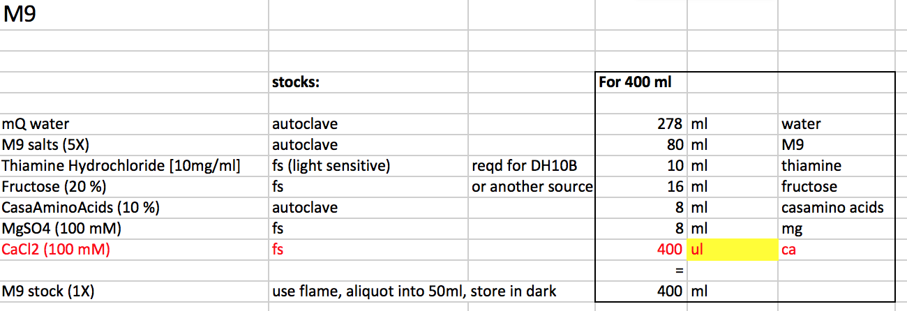

# M9

**Background**: M9 media is used for applications in which (a) the media needs to be more well defined for reproducibility reasons (b) you want to specifically remove certain amino acids for auxotrophy studies (c) to study the production of low level/low brightness fluorescence in cell growth timecourses.

---

### Protocol title
_Outline from Alice's recipe, modified for detail._
_2019 September._

---

##### Components required:

* powders of:
  * M9 salts mix
  * MgSO4 (not autoclavable)
  * CaCl2 (not autoclavable)
  
  * carbon source: eg. fructose
  * amino acids: casamino acids
  * additives for DH10B: thiamine hydrochloride

Locations of chemicals in GBS group:

* M9 salts mix - GBS group stock, RT cupboard
* MgSO4 - gel room
* CaCl2 - gel room  
* fructose - gel room
* casamino acids - GBS group stock, RT cupboard
* additives for DH10B: thiamine hydrochloride - gel room

---

##### Components Prep:

Make up solutions for autoclaving:

* M9 salts (5X): (__282g/500ml; autoclave__)
* Casamino acids (10 % m/v) (__10g/100ml; autoclave__)

Make up solutions for filter sterilising:

* MgSO4 (100 mM) (not autoclavable): (__0.6g/50ml, f/s__)
* CaCl2 (100 mM) (not autoclavable): (__0.735g/50ml, f/s__)
* Fructose 20%: (__20g/100ml, stir in beaker, aliquot when f/s-ing__)
* Thiamine hydrochloride (10mg/ml): (__1g/100ml, don't think it needed stirring, aliquot when f/s-ing__)

Filter sterilise.

Store all at RT except:

* fructose in 4 oC
* thiamine in foil.

---

##### M9 1X:

Recipe here:

Assemble mixture in 500ml nalgene filter bottle. Filter sterilise.
__I usually miss out the CaCl2 since [on contact with MgSO4 it can precipitate](https://www.researchgate.net/post/Crystals_precipitating_out_of_M9_medium).__

Ideally store at 4oC in foil. Label whether it's -/+ CaCl2.

When using, aliquot some into 50ml falcon under a flame, add CaCl2.

---
